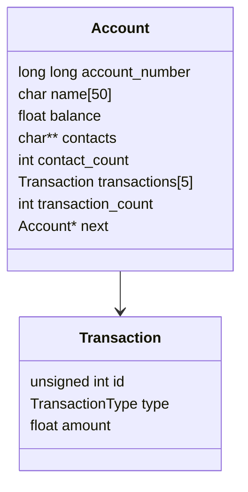

# 💳 Bank Management System

This is a **C language mini-project** that simulates a basic **banking system** for managing multiple user accounts. It features a **menu-driven command-line interface** that allows users to perform essential banking operations, such as:

- Creating new accounts  
- Depositing and withdrawing funds  
- Transferring money between accounts  
- Checking balances  
- Viewing recent transaction history  
- Saving and loading account data using files  

Account information is organized using **structures** and stored dynamically via a **singly linked list (SLL)**. Each account maintains a separate transaction history using **nested structures**, improving clarity and scalability.  

The system supports **persistent data storage** using file handling, ensuring that user data is retained across multiple sessions.  

This project demonstrates key programming concepts such as **modular code organization**, **structure pointers**, **file I/O**, and **user-defined functions**, making it a practical exercise in real-world C application development.

---

## 🧑‍💻 Features:

- 📁 **Create Account**  
- 💰 **Deposit Money**  
- 💸 **Withdraw Money**  
- 🔄 **Transfer Money**  
- 📊 **Check Balance**  
- 🧾 **Transaction History (Last 5)**  
- 🔍 **Search Account**  
- 📂 **Display All Accounts**  
- 💾 **Save Data to File**  
- 🧠 **Load Existing Data on Startup**

---

## 🛠 Technologies Used:

- Programming Language: **C**
- Concepts: **Structures, Linked List, File Handling**
- Tools: **GCC**, **Makefile**

---

## ⚙️ How to Run:

### 🔧 Step 1: Compile the project using make
```bash
make
```

### ▶️ Step 2: Run the executable
```bash
./bank
```

---

## 📘 Menu Options:
```text
------------------MENU---------------------------
C/c : Create account
H/h : View transaction history
W/w : Withdraw amount
D/d : Deposit amount
B/b : Balance enquiry
T/t : Transfer money
E/e : Display all account details
S/s : Save account info to file
F/f : Find specific account
Q/q : Quit application
```

---
## 🧪 Sample Input/Output

```txt
==================================== BANK MANAGEMENT SYSTEM ====================================
c: Create account	h: Transaction history	w: Withdraw
d: Deposit		b: Balance enquiry	t: Transfer
e: Display accounts	s: Save to file		f: Find account
x: Delete Account	q: Quit
Enter choice: 

```

---

## 📂 Project Structure:

```
C_Mini/
├── src/                # C source files (create.c, withdraw.c, etc.)
├── include/            # Header files
├── makefile            # Build file
├── readme.txt          # Usage instructions
└── bank_data.txt       # File storing persistent account info
```

---
## 📐 Data Structure Overview


---

## 📎 Notes:

- Every function like `create_account()`, `withdraw()`, etc. is implemented in a separate source file.
- Transaction info is stored in a nested structure containing:
  - Transaction ID
  - Transaction type (withdraw/deposit)
- Duplicate account numbers are not allowed.
- File-based storage ensures **data is persistent** across runs.

---
## 🌱 Future Enhancements

✨ Add login authentication  
✨ Support interest calculation  
✨ Export data as CSV  
✨ GUI version using C++/GTK  

---
## 👨‍💻 Author

- 🎓 Developed by: *Salapu Udhaya Sri Kalyani*
- 🏫 Mini Project
- 🎯 Tech: C language, File Handling, Linked Lists, Pointers

---


